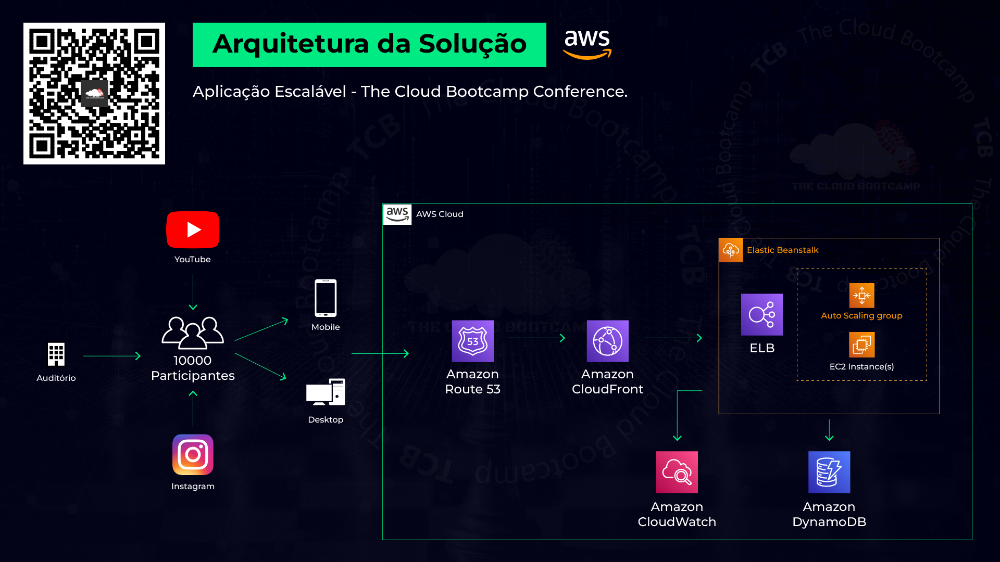
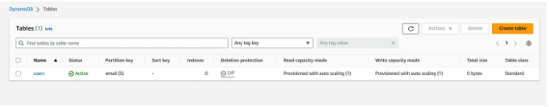

# Aplicacao-web-escalavel
Implementação de uma Aplicação Web Escalável utilizando os serviços do Elastic Beanstalk, DynamoDB, CloudFront e Edge Location da AWS

Nesse projeto baseado em um cenário do mundo real, fui responsável por implementar uma aplicação que precisa suportar a alta demanda de um grande número de usuários acessando simultaneamente. Esta aplicação foi utilizada em uma grande conferência que contou com mais de 10.000 pessoas, presencialmente e online, contando com participantes de todo o mundo.

O evento foi transmitido pela internet e presencialmente e foram sorteados 10 vouchers para 3 certificações de Cloud. Nesse momento os mais de 10.000 conferencistas cadastraram seus e-mails para garantir a participação no sorteio.

Na AWS, foram utilizados os serviços do Elastic Beanstalk para deploy da aplicação web, DynamoDB para armazenar os e-mails, CloudFront para fazer o caching dos arquivos estáticos e dinâmicos em uma Edge Location próxima ao usuário.

Abaixo está a arquitetura do projeto.

O primeiro passo foi criar um banco de dados usando o Amazon DynamoDB (nosql), que é onde será salvo os dados cadastrados no evento:

Após a criação do banco de dados vamos utilizar o serviço da AWS Elastic Beanstalk para deploy da aplicação web, no serviço configurei como seria a estrutura que eu preciso para rodar a aplicação. Foi criado um ambiente com alta disponibilidade, onde foi definido um mínimo de 2 instância EC2 e no máximo 4.

Ao utilizar o Elastic Beanstalk foi usada a VPC padrão da AWS, onde ela criou toda estrutura para conseguirmos acessar a aplicação, como o Route 53, depois de finalizado nós criamos também o CloudFront , que depois de criado forneceu o link de acesso a aplicação.

Depois de tudo isso, acessei uma das instâncias para gente testar os recursos, no caso fazer um teste de stress na aplicação, para ver como iria se comportar. E ver como o Elastic Load Balancer iria distribuir a carga e também como o Auto Escaling iria criar novas instâncias conforme a necessidade.

Conforme o teste acompanhei como estava se comportando a aplicação e vendo os eventos que ela informava.

Ao gerar o teste de stress no Elastic Beanstalk já mostra um ponto de atenção, e conforme sobe a carga a o Auto Escaling já faz a criação de novas instâncias EC2 conforme programado.

Isso tudo de forma automática, e meu trabalho é só monitorar as aplicações.

Mais um projeto fantástico que simula um projeto real, que faz com que eu posso conhecer mais serviços da AWS

